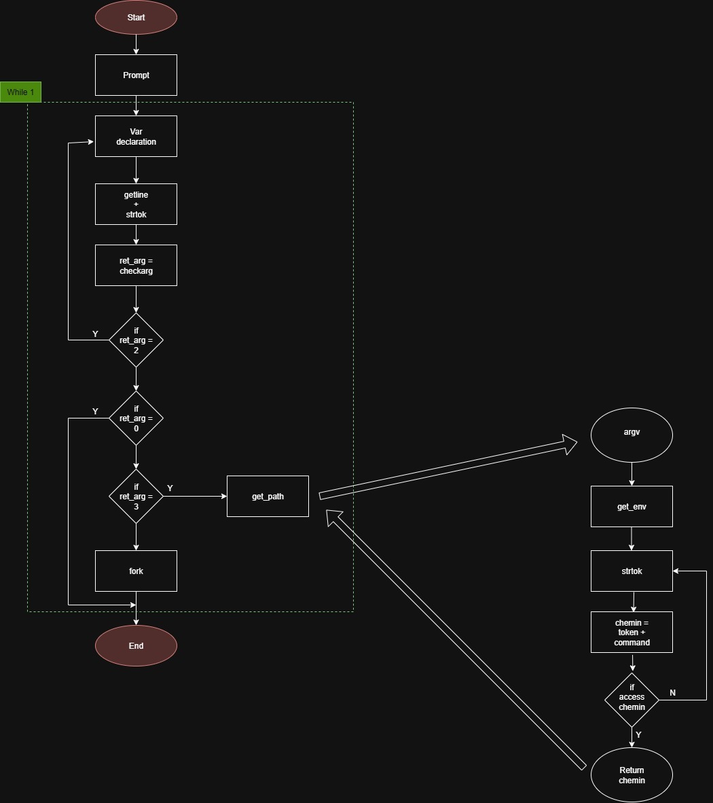
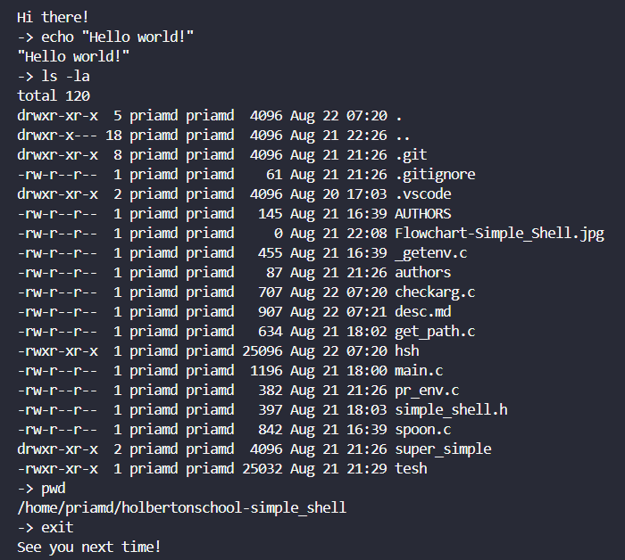

This minimal shell runs in an infinite loop, displaying a prompt `(->)` to the user as a signal to input a command line.<br/>
It then parses the command, tokening it into arguments ready for execution.<br/> Should the user input nothing or any string of characters that doesn't match a known command, our shell will behave similarly to the standard shell, printing error messages or prompting again as appropriate.

## The rules we followed
+ Edition was made on VS code.
+ We put a lot of effort to built a beautiful and fonctional README
+ To have a nice, readable and easily understandable code we followed the Betty coding style
+ To serve this purpose we separated as much as possible the different functions on different files
+ We used system calls only when needed
+ We fought the memory leaks with honor and tenacity, but unfortunetly we suffered huge losses on this battlefield
+ FYI : We wanted to add a nice and unique personnality to our shell but unfortunately all of our strength was focused on defeating our enemy, Sir Valgrind the Ruthless.

## Understanding our Shell
### Man page
The man page can be invoked with the following command:<br/>
`man ./hsh_man`

### Flowchart
A picture is worth a thousand words (at least, we hope so).<br/>


### Structure of files
|&nbsp;.gitignore &nbsp;&nbsp;&nbsp;&nbsp;&nbsp;&nbsp;&nbsp;&nbsp;&nbsp;&nbsp;&nbsp;&nbsp;&nbsp;|&nbsp;&nbsp;&nbsp;&nbsp;&nbsp;&nbsp;&nbsp;&nbsp;&nbsp;&nbsp;&nbsp;&nbsp;&nbsp;&nbsp;&nbsp;file containing all the tests and executable files<br/>
|&nbsp;_gentenv.c&nbsp;&nbsp;&nbsp;&nbsp;&nbsp;&nbsp;&nbsp;&nbsp;&nbsp;&nbsp;&nbsp;&nbsp;|&nbsp;&nbsp;&nbsp;&nbsp;&nbsp;&nbsp;&nbsp;&nbsp;&nbsp;&nbsp;&nbsp;&nbsp;&nbsp;&nbsp;&nbsp;function to get the value of the passed env variable<br/>
|&nbsp;AUTHORS&nbsp;&nbsp;&nbsp;&nbsp;&nbsp;&nbsp;&nbsp;&nbsp;&nbsp;&nbsp;&nbsp;&nbsp;&nbsp;|&nbsp;&nbsp;&nbsp;&nbsp;&nbsp;&nbsp;&nbsp;&nbsp;&nbsp;&nbsp;&nbsp;&nbsp;&nbsp;&nbsp;&nbsp;files containing info about the people who contributed<br/>
|&nbsp;checkarg.c&nbsp;&nbsp;&nbsp;&nbsp;&nbsp;&nbsp;&nbsp;&nbsp;&nbsp;&nbsp;&nbsp;&nbsp;|&nbsp;&nbsp;&nbsp;&nbsp;&nbsp;&nbsp;&nbsp;&nbsp;&nbsp;&nbsp;&nbsp;&nbsp;&nbsp;&nbsp;&nbsp;function to analyzes the first argument passed to the program<br/>
|&nbsp;get_path.c&nbsp;&nbsp;&nbsp;&nbsp;&nbsp;&nbsp;&nbsp;&nbsp;&nbsp;&nbsp;&nbsp;&nbsp;&nbsp;|&nbsp;&nbsp;&nbsp;&nbsp;&nbsp;&nbsp;&nbsp;&nbsp;&nbsp;&nbsp;&nbsp;&nbsp;&nbsp;&nbsp;&nbsp;finds directory in which the passed command has been found<br/>
|&nbsp;hsh_man&nbsp;&nbsp;&nbsp;&nbsp;&nbsp;&nbsp;&nbsp;&nbsp;&nbsp;&nbsp;&nbsp;&nbsp;&nbsp;&nbsp;&nbsp;|&nbsp;&nbsp;&nbsp;&nbsp;&nbsp;&nbsp;&nbsp;&nbsp;&nbsp;&nbsp;&nbsp;&nbsp;&nbsp;&nbsp;&nbsp;manual page of hsh<br/>
|&nbsp;main.c&nbsp;&nbsp;&nbsp;&nbsp;&nbsp;&nbsp;&nbsp;&nbsp;&nbsp;&nbsp;&nbsp;&nbsp;&nbsp;&nbsp;&nbsp;&nbsp;&nbsp;&nbsp;&nbsp;|&nbsp;&nbsp;&nbsp;&nbsp;&nbsp;&nbsp;&nbsp;&nbsp;&nbsp;&nbsp;&nbsp;&nbsp;&nbsp;&nbsp;&nbsp;main function (entry point of the prog)<br/>
|&nbsp;pr_env.c&nbsp;&nbsp;&nbsp;&nbsp;&nbsp;&nbsp;&nbsp;&nbsp;&nbsp;&nbsp;&nbsp;&nbsp;&nbsp;&nbsp;&nbsp;&nbsp;|&nbsp;&nbsp;&nbsp;&nbsp;&nbsp;&nbsp;&nbsp;&nbsp;&nbsp;&nbsp;&nbsp;&nbsp;&nbsp;&nbsp;&nbsp;function that prints the environement variables to the stdout<br/>
|&nbsp;README.md &nbsp;&nbsp;&nbsp;&nbsp;&nbsp;&nbsp;&nbsp;&nbsp;|&nbsp;&nbsp;&nbsp;&nbsp;&nbsp;&nbsp;&nbsp;&nbsp;&nbsp;&nbsp;&nbsp;&nbsp;&nbsp;&nbsp;&nbsp;explanation of the project<br/>
|&nbsp;simple_shell.h&nbsp;&nbsp;&nbsp;&nbsp;&nbsp;&nbsp;&nbsp;|&nbsp;&nbsp;&nbsp;&nbsp;&nbsp;&nbsp;&nbsp;&nbsp;&nbsp;&nbsp;&nbsp;&nbsp;&nbsp;&nbsp;&nbsp;header containing all used fonctions and librairies<br/>
|&nbsp;spoon.c&nbsp;&nbsp;&nbsp;&nbsp;&nbsp;&nbsp;&nbsp;&nbsp;&nbsp;&nbsp;&nbsp;&nbsp;&nbsp;&nbsp;&nbsp;&nbsp;&nbsp;|&nbsp;&nbsp;&nbsp;&nbsp;&nbsp;&nbsp;&nbsp;&nbsp;&nbsp;&nbsp;&nbsp;&nbsp;&nbsp;&nbsp;&nbsp;function to launches a fork process<br/>

## Uses and tests
### Compiling
Compile using following command :
```
gcc -Wall -Werror -Wextra -pedantic -std=gnu89 *.c -o hsh
```
These ensured we would catch all possible issues and that our shell would have good portability.<br/>

### Usage
Simply invoke it with `./hsh`, wait for the welcome message and prompt to show (it won't take long, we promise!) then type in your commands.<br/>
Note that it works both interactively and not, like so:<br/>
```
User@Ubuntu:/$ ./hsh
Hi there!
-> ls
AUTHORS _getenv.c checkarg.c get_path.c hsh images main.c pr_env.c simple_shell.h spoon.c
-> exit
See you next time!
User@Ubuntu:/$ echo "/bin/ls" | ./hsh
AUTHORS _getenv.c checkarg.c get_path.c hsh images main.c pr_env.c simple_shell.h spoon.c
```
### Functionalities
This simple shell takes into account two built-ins: `exit` and `env`. Typing `exit` will close the shell, and `env` will print the contents of the environment variable.<br/>
It can also be used for basic commands sur as `ls`, `cp`, `rm`, or `pwd`, the latter being both a built-in and a binary command.<br/>
Here are some of them in action:<br/>

<br/>As shown, there is no need to input the path to the desired commands' location, as `PATH` is handled.<br/>

## Possible improvements and known bugs
* The `cd` command has not been implemented at this date.

## Authors
Your most obliged and humble servants:
<br/>
The bad girl Sarah Wacquiez
<br/>
and the bad boy Priam Demailly
